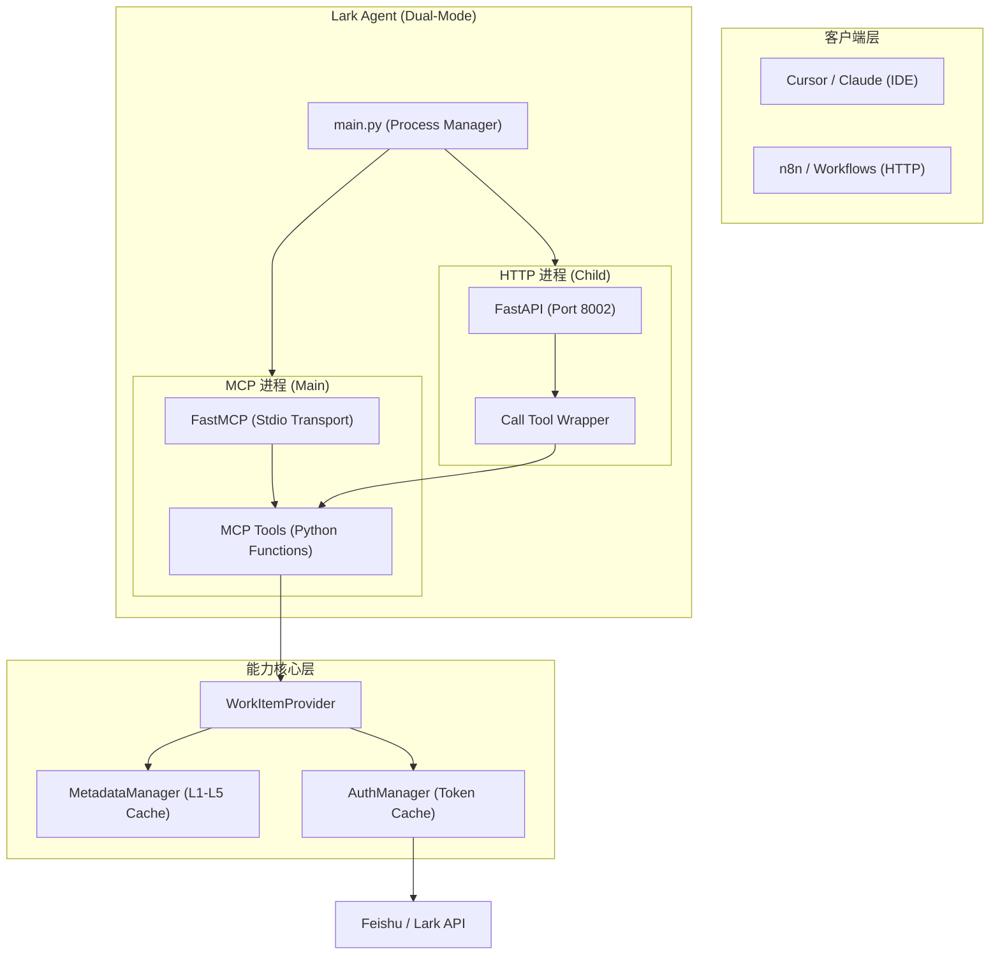

# Lark Agent (MCP Server)

[](https://github.com/Wulnut/lark_agent/actions/workflows/ci.yml)

这是一个基于 [Model Context Protocol (MCP)](https://modelcontextprotocol.io/) 构建的飞书 (Lark/Feishu) 智能代理服务。它采用 **双模运行 (Dual-Mode)** 架构，既是一个标准 MCP Server，也通过 FastAPI 暴露 HTTP API，完美支持 AI 助手 (Cursor/Claude) 调用和自动化工作流 (n8n) 集成。

## ✨ 核心特性

* **双模运行**:
  * **MCP Mode**: 运行在主进程，通过 Stdio 协议与 Cursor、Claude Desktop 等 IDE/客户端无缝集成。
  * **HTTP Mode**: 运行在后台子进程，通过 FastAPI 暴露标准的 RESTful 接口，适配 n8n、Zapier 等 Webhook 触发器。
* **飞书项目全集成**: 支持跨项目的任务 CRUD、高级过滤查询、字段元数据解析。
* **企业级架构**:
  * **Async First**: 全异步架构，基于 `asyncio` 和 `httpx` 实现极高性能。
  * **Metadata Manager**: 具备 5 层缓存机制，自动解析飞书项目中的复杂字段 Key/Value，实现**零硬编码**。
  * **Provider 模式**: 业务逻辑与底层飞书 SDK/API 彻底解耦，易于扩展。
  * **自动重试 & 脱敏**: 完善的错误重试机制（指数退避）及敏感信息脱敏保护。
* **多重认证支持**: 支持 Static Token（快速上手）和 Plugin Authentication（企业生产推荐）。

---

## 🏗️ 系统架构



---

## 🛠️ 可用工具 (MCP Tools)

| 工具名 | 功能描述 | 核心业务场景 |
|--------|---------|-------------|
| `list_projects` | 列出所有可用项目及 Key | 初始探索、查找项目 ID |
| `create_task` | 创建单条工作项 | 快速记录 Bug、新增需求 |
| `get_tasks` | 全方位过滤查询工作项 | 查看我的任务、列出 P0 Bug |
| `get_task_detail` | 获取工作项完整详情 | 查看任务描述、属性详情 |
| `update_task` | 更新单个工作项字段 | 修改状态、指派负责人 |
| `batch_update_tasks` | **[NEW]** 批量更新多个工作项 | 批量结单、批量改优先级 |
| `get_task_options` | 查询字段可用选项 | 确认状态流转、查看优先级列表 |

---

## 🚀 快速开始

### 方式一：通过 `uv tool install`（推荐，最简单）

```bash
# 1. 安装
uv tool install --from git+https://github.com/Wulnut/lark_agent lark-agent

# 2. 配置环境变量 (见下方配置说明)
# 3. 直接运行
lark-agent
```

### 方式二：从源码运行（开发模式）

```bash
# 1. 克隆与进入目录
git clone https://github.com/Wulnut/lark_agent.git && cd lark_agent

# 2. 安装依赖并同步环境
uv sync

# 3. 运行服务
uv run main.py
```

---

## ⚙️ 环境配置

在项目根目录创建 `.env` 文件：

```env
# --- 飞书项目配置 (必须) ---
FEISHU_PROJECT_USER_KEY=your_user_key

# 方案 A: 插件认证 (企业推荐，支持自动续期)
FEISHU_PROJECT_PLUGIN_ID=your_plugin_id
FEISHU_PROJECT_PLUGIN_SECRET=your_plugin_secret

# 方案 B: 静态 Token (个人测试，有效期 24h)
# FEISHU_PROJECT_USER_TOKEN=your_token

# --- 飞书机器人配置 (可选，用于 IM 通讯) ---
LARK_APP_ID=your_app_id
LARK_APP_SECRET=your_app_secret

# --- 系统配置 ---
LOG_LEVEL=INFO
FEISHU_PROJECT_KEY=默认项目KEY (可选)
```

---

## 🔌 客户端集成

### 1. Cursor IDE 配置

编辑 `~/.cursor/mcp.json`：

```json
{
  "mcpServers": {
    "lark-agent": {
      "command": "lark-agent"
    }
  }
}
```

### 2. n8n / HTTP 调用

服务启动后，HTTP 端口默认为 `8002`。

* **健康检查**: `GET http://localhost:8002/health`
* **调用工具**: `POST http://localhost:8002/call_tool`

    ```json
    {
      "tool_name": "list_projects",
      "parameters": {},
      "user_key": "your_user_key"
    }
    ```

---

## 🧪 测试与质量

本项目严格遵循 **TDD (测试驱动开发)**。

* **单元测试**: 覆盖核心 Provider、Metadata 及授权逻辑。
* **模拟环境**: 使用 `respx` 拦截 HTTP 请求，无需真实 Token 即可运行。
* **运行测试**: `uv run pytest` (当前 **135+** 测试用例全部通过)。

---

## 📏 开发规范

* **异步规范**: 所有 I/O 必须 `await`。
* **零硬编码**: 必须通过 `MetadataManager` 解析字段别名。
* **错误过滤**: 确保敏感堆栈信息不透传给 LLM。

---

## 📂 项目结构

```text
src/
├── core/           # 核心逻辑 (Auth, Config, Cache, Client)
├── providers/      # 业务 Provider (Project, Meta Managers)
├── schemas/        # Pydantic 数据模型 (API 交互标准)
├── http_server.py  # HTTP 包装层 (FastAPI)
├── mcp_server.py   # MCP 接口定义与工具注册
main.py             # 双模启动入口 & 进程管理
```

---

## 📄 许可

MIT License. 版权所有 © 2026 Wulnut.
