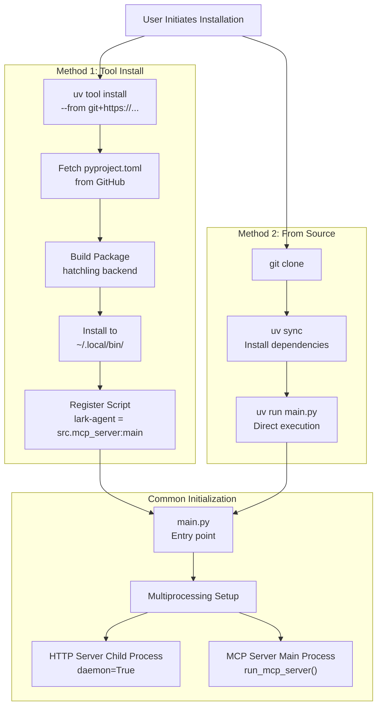
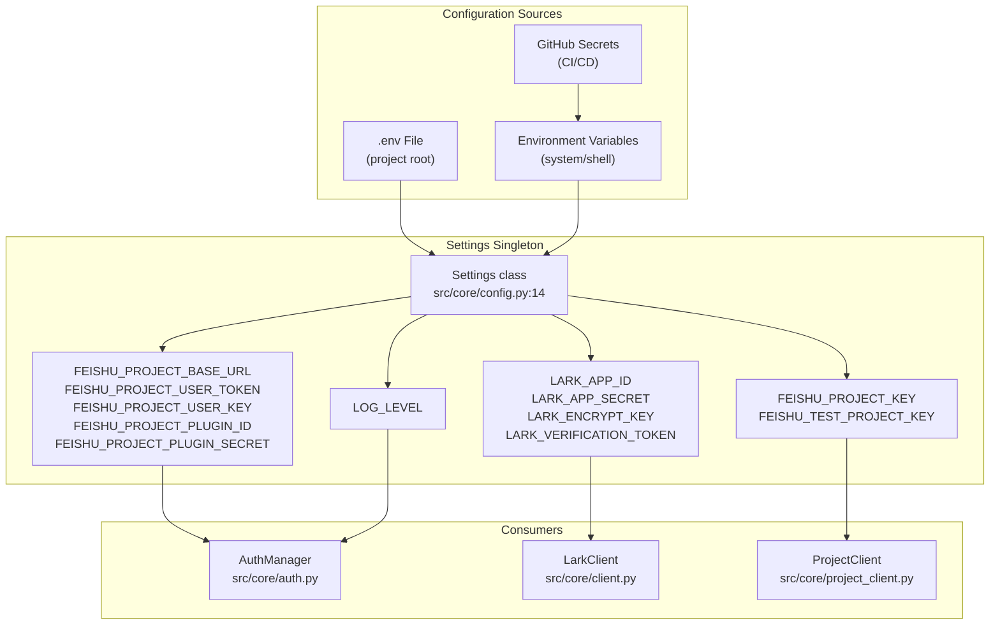
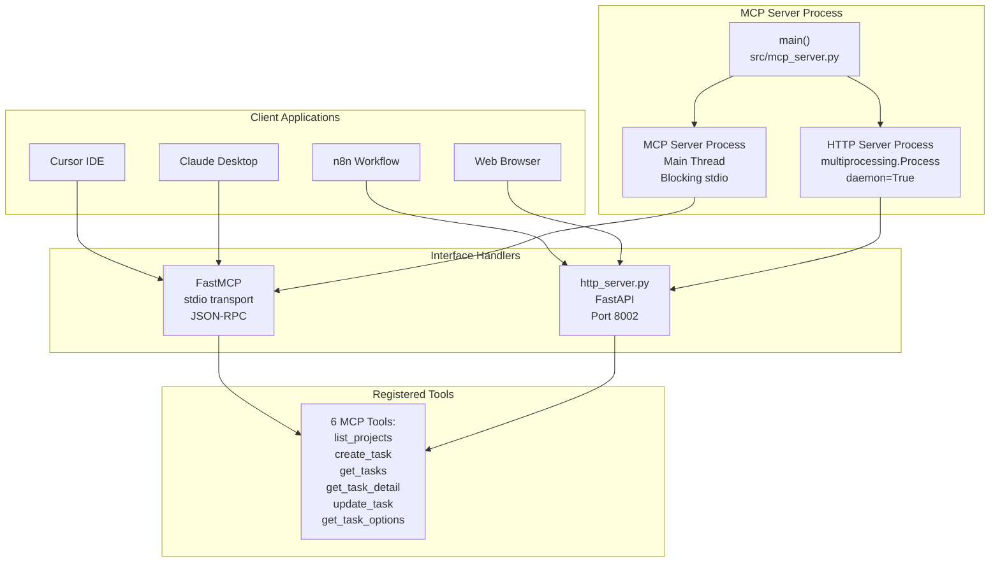
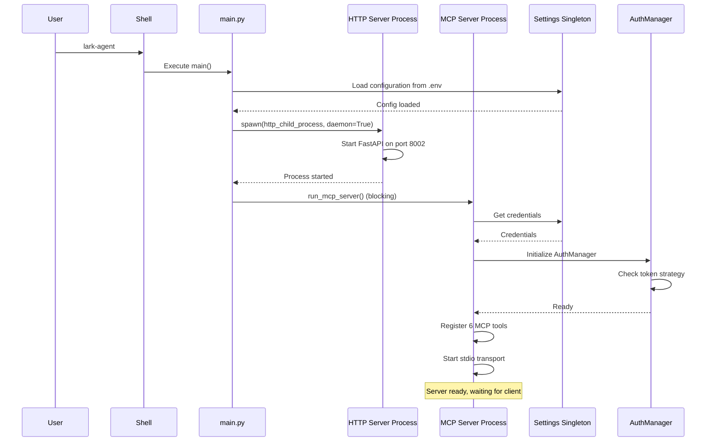
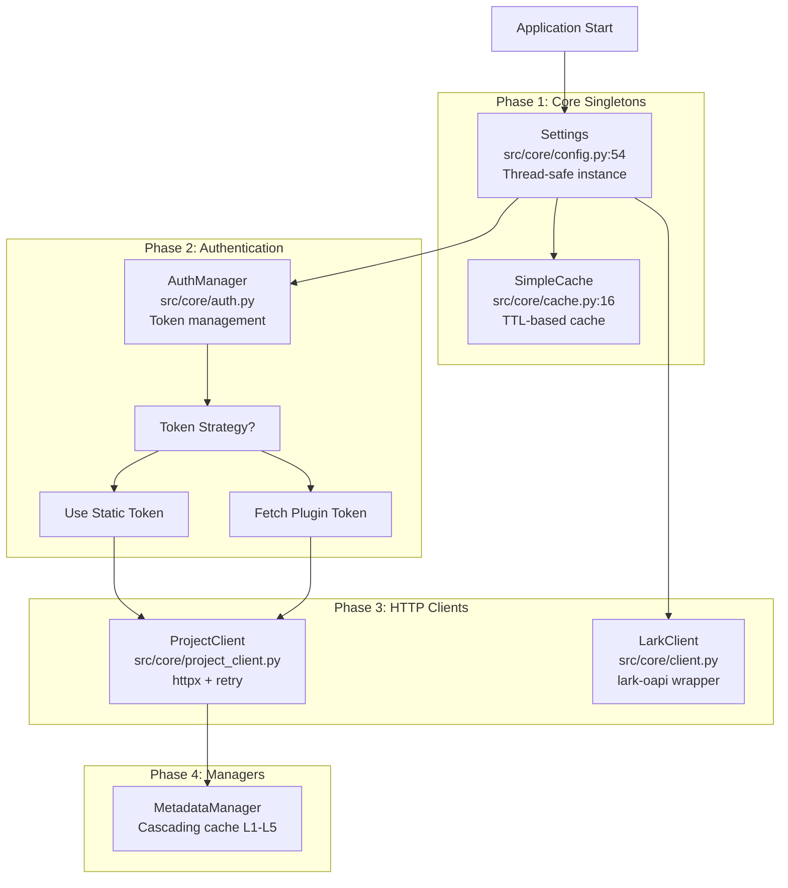

# Getting Started

> **Relevant source files**
> * [.env.example](https://github.com/Wulnut/lark_agent/blob/e9d158cb/.env.example)
> * [AGENTS.md](https://github.com/Wulnut/lark_agent/blob/e9d158cb/AGENTS.md)
> * [README.md](https://github.com/Wulnut/lark_agent/blob/e9d158cb/README.md)
> * [doc/Planning/Planning_1.md](https://github.com/Wulnut/lark_agent/blob/e9d158cb/doc/Planning/Planning_1.md)
> * [doc/Planning/Progress.md](https://github.com/Wulnut/lark_agent/blob/e9d158cb/doc/Planning/Progress.md)
> * [pyproject.toml](https://github.com/Wulnut/lark_agent/blob/e9d158cb/pyproject.toml)
> * [src/__init__.py](https://github.com/Wulnut/lark_agent/blob/e9d158cb/src/__init__.py)
> * [src/core/cache.py](https://github.com/Wulnut/lark_agent/blob/e9d158cb/src/core/cache.py)
> * [src/core/client.py](https://github.com/Wulnut/lark_agent/blob/e9d158cb/src/core/client.py)
> * [src/core/config.py](https://github.com/Wulnut/lark_agent/blob/e9d158cb/src/core/config.py)
> * [src/schemas/project.py](https://github.com/Wulnut/lark_agent/blob/e9d158cb/src/schemas/project.py)
> * [tests/conftest.py](https://github.com/Wulnut/lark_agent/blob/e9d158cb/tests/conftest.py)
> * [tests/unit/core/test_config.py](https://github.com/Wulnut/lark_agent/blob/e9d158cb/tests/unit/core/test_config.py)

This page provides a comprehensive guide to installing, configuring, and running the Lark Agent MCP Server. It covers the essential steps to get the server operational and integrated with AI assistants like Cursor or Claude Desktop. For detailed architecture information, see [Architecture](/Wulnut/lark_agent/3-architecture). For specific MCP tool usage, see [MCP Tools Reference](/Wulnut/lark_agent/5-mcp-tools-reference).

---

## Prerequisites

Before installing the Lark Agent, ensure you have:

| Requirement | Version | Purpose |
| --- | --- | --- |
| Python | 3.11+ | Runtime environment |
| uv | Latest | Package manager (recommended) |
| Feishu Project Access | N/A | API credentials required |
| Lark App Credentials | N/A | Optional, only for IM features |

**Required Credentials:**

* `FEISHU_PROJECT_USER_KEY`: Your Feishu Project user key
* Either `FEISHU_PROJECT_USER_TOKEN` (static token) or `FEISHU_PROJECT_PLUGIN_ID` + `FEISHU_PROJECT_PLUGIN_SECRET` (plugin authentication, preferred)

**Optional Credentials** (only needed for instant messaging features):

* `LARK_APP_ID` and `LARK_APP_SECRET`: Lark application credentials

Sources: [README.md L183-L186](https://github.com/Wulnut/lark_agent/blob/e9d158cb/README.md#L183-L186)

 [src/core/config.py L14-L34](https://github.com/Wulnut/lark_agent/blob/e9d158cb/src/core/config.py#L14-L34)

 [.env.example L1-L28](https://github.com/Wulnut/lark_agent/blob/e9d158cb/.env.example#L1-L28)

---

## Installation Methods

The Lark Agent supports two installation methods. For detailed instructions, see [Installation](/Wulnut/lark_agent/2.1-installation).

### Method 1: Tool Install (Recommended)

The `uv tool install` method provides the simplest installation experience:

```python
# Install directly from GitHub
uv tool install --from git+https://github.com/Wulnut/lark_agent lark-agent

# The command becomes globally available
lark-agent
```

After installation, the `lark-agent` command is automatically added to your system PATH, as defined in [pyproject.toml L21-L22](https://github.com/Wulnut/lark_agent/blob/e9d158cb/pyproject.toml#L21-L22)

### Method 2: From Source

For development or customization:

```markdown
# Clone repository
git clone https://github.com/Wulnut/lark_agent.git
cd lark_agent

# Install dependencies
uv sync

# Run directly
uv run main.py
```

**Installation Flow Diagram:**



Sources: [README.md L169-L223](https://github.com/Wulnut/lark_agent/blob/e9d158cb/README.md#L169-L223)

 [pyproject.toml L1-L44](https://github.com/Wulnut/lark_agent/blob/e9d158cb/pyproject.toml#L1-L44)

---

## Configuration

Configuration is managed through environment variables loaded by the `Settings` class. For detailed configuration options, see [Configuration](/Wulnut/lark_agent/2.2-configuration).

### Configuration Loading Flow

The system uses `pydantic-settings` to load configuration from multiple sources with priority:



### Minimal Configuration

Create a `.env` file in the project root:

```markdown
# Feishu Project API Configuration (Required)
FEISHU_PROJECT_USER_KEY=your_user_key

# Option 1: Static Token (Backward Compatible)
FEISHU_PROJECT_USER_TOKEN=your_static_token

# Option 2: Plugin Authentication (Preferred)
FEISHU_PROJECT_PLUGIN_ID=your_plugin_id
FEISHU_PROJECT_PLUGIN_SECRET=your_plugin_secret

# Optional: Lark IM Features
LARK_APP_ID=your_app_id
LARK_APP_SECRET=your_app_secret

# Optional: Logging
LOG_LEVEL=INFO
```

The `Settings` class automatically validates required fields on initialization [src/core/config.py L14-L54](https://github.com/Wulnut/lark_agent/blob/e9d158cb/src/core/config.py#L14-L54)

**Authentication Priority:**

1. Static token (`FEISHU_PROJECT_USER_TOKEN`) is checked first
2. If not found, plugin credentials are used to fetch a dynamic token
3. Tokens are cached with a 60-second expiry buffer

Sources: [.env.example L1-L28](https://github.com/Wulnut/lark_agent/blob/e9d158cb/.env.example#L1-L28)

 [src/core/config.py L14-L54](https://github.com/Wulnut/lark_agent/blob/e9d158cb/src/core/config.py#L14-L54)

---

## Client Integration

The Lark Agent exposes two interfaces for client integration. For detailed client configuration, see [Client Integration](/Wulnut/lark_agent/2.3-client-integration).

### Interface Architecture



### MCP Client Configuration

**Cursor IDE** (`~/.cursor/mcp.json`):

```json
{
  "mcpServers": {
    "lark-agent": {
      "command": "lark-agent"
    }
  }
}
```

**Claude Desktop** (macOS: `~/Library/Application Support/Claude/claude_desktop_config.json`):

```json
{
  "mcpServers": {
    "lark-agent": {
      "command": "lark-agent"
    }
  }
}
```

**From Source Configuration:**

```json
{
  "mcpServers": {
    "lark-agent": {
      "command": "uv",
      "args": [
        "run",
        "--directory",
        "/path/to/lark_agent",
        "main.py"
      ]
    }
  }
}
```

Sources: [README.md L228-L309](https://github.com/Wulnut/lark_agent/blob/e9d158cb/README.md#L228-L309)

---

## Quick Start Workflow

This section demonstrates a complete startup and verification workflow.

### Step-by-Step Startup



### First Request Flow

```mermaid
sequenceDiagram
  participant AI Assistant
  participant MCP Server
  participant _create_provider()
  participant MetadataManager
  participant ProjectAPI
  participant Feishu API

  AI Assistant->>MCP Server: list_projects
  MCP Server->>_create_provider(): Create provider instance
  _create_provider()->>MetadataManager: get_instance()
  MetadataManager-->>_create_provider(): MetadataManager singleton
  MCP Server->>ProjectAPI: list_projects()
  ProjectAPI->>Feishu API: POST /project/api/list
  Feishu API-->>ProjectAPI: Project list JSON
  ProjectAPI->>MetadataManager: Cache projects (TTL=3600s)
  ProjectAPI-->>MCP Server: Parsed project dict
  MCP Server-->>AI Assistant: {"ProjectA": "project_xxx", "ProjectB": "project_yyy"}
```

Sources: [src/mcp_server.py L1-L400](https://github.com/Wulnut/lark_agent/blob/e9d158cb/src/mcp_server.py#L1-L400)

---

## Verification Steps

After installation and configuration, verify the server is working correctly.

### 1. Check Server Startup

When the server starts successfully, you should see:

```
INFO - Starting Lark Agent MCP Server
INFO - HTTP API server will be available at http://localhost:8002
INFO - MCP server running in stdio mode
```

Logs are written to `log/agent.log` for stdio mode.

### 2. Verify HTTP API (Optional)

If the HTTP server is enabled, test the API:

```markdown
# Check API documentation
curl http://localhost:8002/docs

# Test list projects endpoint
curl -X POST http://localhost:8002/list_projects
```

### 3. Test MCP Tools

In your AI assistant (Cursor/Claude), try:

```yaml
User: "List all available Feishu projects"
AI: Calls list_projects tool
Expected: Returns project name to project_key mapping
```

```sql
User: "Create a task named 'Test MCP Integration' with P2 priority"
AI: Calls create_task tool
Expected: Returns success message with issue_id
```

### 4. Verify Configuration Loading

Check that credentials are loaded correctly:

```javascript
# Run test script to validate configuration
uv run python -c "from src.core.config import settings; print(f'User Key: {settings.FEISHU_PROJECT_USER_KEY[:4]}***')"
```

**Common Issues:**

| Issue | Solution |
| --- | --- |
| `FEISHU_PROJECT_USER_KEY` not set | Verify `.env` file exists in project root |
| Authentication failures | Check token validity or plugin credentials |
| Import errors | Run `uv sync` to install dependencies |
| Port 8002 in use | Change port in HTTP server configuration |

Sources: [README.md L224-L227](https://github.com/Wulnut/lark_agent/blob/e9d158cb/README.md#L224-L227)

 [tests/conftest.py L1-L110](https://github.com/Wulnut/lark_agent/blob/e9d158cb/tests/conftest.py#L1-L110)

---

## Server Initialization Details

Understanding the initialization process helps troubleshoot startup issues.

### Singleton Initialization Order



### Tool Registration Process

When the MCP server initializes, it registers six tools using the `@mcp.tool()` decorator:

1. **`list_projects`** [src/mcp_server.py](https://github.com/Wulnut/lark_agent/blob/e9d158cb/src/mcp_server.py#LNaN-LNaN) : Returns project name to key mapping
2. **`create_task`** [src/mcp_server.py](https://github.com/Wulnut/lark_agent/blob/e9d158cb/src/mcp_server.py#LNaN-LNaN) : Creates a new work item
3. **`get_tasks`** [src/mcp_server.py](https://github.com/Wulnut/lark_agent/blob/e9d158cb/src/mcp_server.py#LNaN-LNaN) : Lists work items with filtering
4. **`get_task_detail`** [src/mcp_server.py](https://github.com/Wulnut/lark_agent/blob/e9d158cb/src/mcp_server.py#LNaN-LNaN) : Gets full work item details with readable fields
5. **`update_task`** [src/mcp_server.py](https://github.com/Wulnut/lark_agent/blob/e9d158cb/src/mcp_server.py#LNaN-LNaN) : Updates work item fields
6. **`get_task_options`** [src/mcp_server.py](https://github.com/Wulnut/lark_agent/blob/e9d158cb/src/mcp_server.py#LNaN-LNaN) : Discovers available field options

Each tool creates a fresh `WorkItemProvider` instance via `_create_provider()` [src/mcp_server.py](https://github.com/Wulnut/lark_agent/blob/e9d158cb/src/mcp_server.py#LNaN-LNaN)

 to ensure context isolation between requests.

Sources: [src/mcp_server.py L1-L400](https://github.com/Wulnut/lark_agent/blob/e9d158cb/src/mcp_server.py#L1-L400)

 [src/core/auth.py L1-L150](https://github.com/Wulnut/lark_agent/blob/e9d158cb/src/core/auth.py#L1-L150)

 [src/core/project_client.py L1-L200](https://github.com/Wulnut/lark_agent/blob/e9d158cb/src/core/project_client.py#L1-L200)

---

## Next Steps

After completing the getting started workflow:

1. **Explore MCP Tools**: See [MCP Tools Reference](/Wulnut/lark_agent/5-mcp-tools-reference) for detailed tool documentation
2. **Understand Architecture**: Read [Architecture](/Wulnut/lark_agent/3-architecture) to learn about the four-layer design
3. **Customize Configuration**: See [Configuration](/Wulnut/lark_agent/2.2-configuration) for advanced options
4. **Development**: See [Development Guide](/Wulnut/lark_agent/6-development-guide) if you plan to contribute or extend the codebase

For troubleshooting common issues, see [Troubleshooting](/Wulnut/lark_agent/8-troubleshooting).

Sources: [README.md L1-L393](https://github.com/Wulnut/lark_agent/blob/e9d158cb/README.md#L1-L393)

 [doc/Planning/Progress.md L1-L110](https://github.com/Wulnut/lark_agent/blob/e9d158cb/doc/Planning/Progress.md#L1-L110)