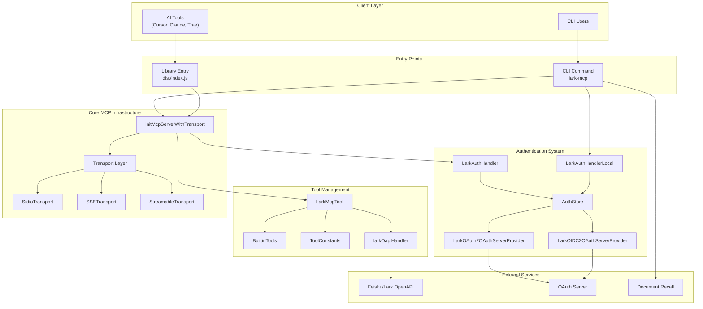
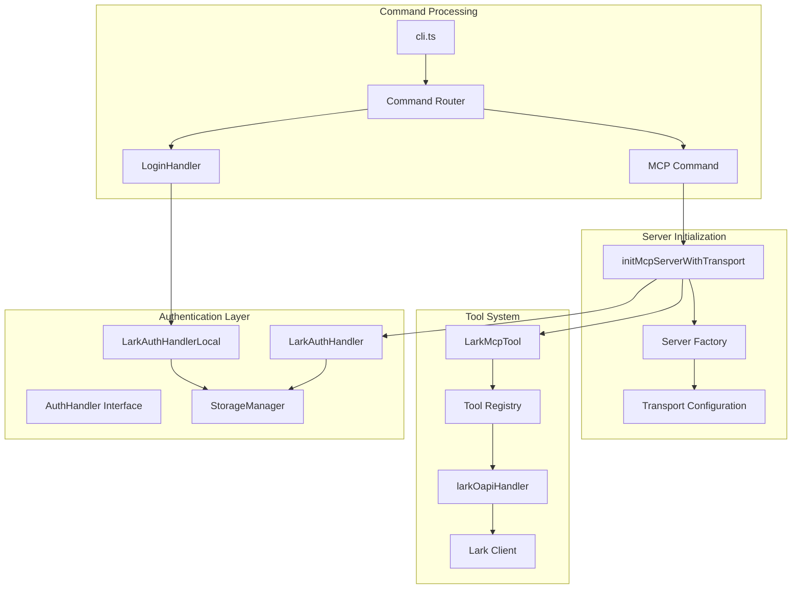

# Overview

> **Relevant source files**
> * [CHANGELOG.md](https://github.com/larksuite/lark-openapi-mcp/blob/a987f280/CHANGELOG.md)
> * [README.md](https://github.com/larksuite/lark-openapi-mcp/blob/a987f280/README.md)
> * [package.json](https://github.com/larksuite/lark-openapi-mcp/blob/a987f280/package.json)

This document provides a comprehensive overview of the lark-mcp project, a Model Context Protocol (MCP) bridge that enables AI tools to interact with Feishu/Lark OpenAPI services. The system wraps Feishu/Lark APIs as MCP tools, providing authentication, transport mechanisms, and tool management capabilities.

For detailed information about specific CLI commands and authentication flows, see [CLI Interface](/larksuite/lark-openapi-mcp/6-cli-interface). For documentation about the MCP tool system and API wrappers, see [MCP Tools](/larksuite/lark-openapi-mcp/4-mcp-tools). For information about the specialized document retrieval service, see [Document Recall Feature](/larksuite/lark-openapi-mcp/5-document-recall-feature).

## System Architecture

The lark-mcp system consists of several interconnected components that work together to provide MCP services for Feishu/Lark integration:

### High-Level Architecture



Sources: [README.md L1-L446](https://github.com/larksuite/lark-openapi-mcp/blob/a987f280/README.md#L1-L446)

 [package.json L1-L64](https://github.com/larksuite/lark-openapi-mcp/blob/a987f280/package.json#L1-L64)

### Core Component Relationships

The system follows a layered architecture where each component has specific responsibilities:



Sources: [README.md L60-L89](https://github.com/larksuite/lark-openapi-mcp/blob/a987f280/README.md#L60-L89)

 [package.json L9-L10](https://github.com/larksuite/lark-openapi-mcp/blob/a987f280/package.json#L9-L10)

## Core Components

### Package Structure

The lark-mcp package is distributed as `@larksuiteoapi/lark-mcp` with the main entry point at `dist/index.js` and CLI binary at `dist/cli.js`. The package supports Node.js versions 20.0.0 and above and includes dependencies for MCP SDK, Feishu/Lark Node SDK, and various utility libraries.

### Transport Mechanisms

The system supports three transport modes for MCP communication:

| Transport Mode | Use Case | Implementation |
| --- | --- | --- |
| `stdio` | Direct AI tool integration | Standard input/output streams |
| `sse` | HTTP-based with Server-Sent Events | Express server with SSE endpoints |
| `streamable` | HTTP-based with streaming | StreamableHTTP protocol |

### Authentication System

The authentication system handles both application-level and user-level authentication:

* **Application Authentication**: Uses App ID and App Secret for tenant access tokens
* **User Authentication**: Supports OAuth2 and OIDC flows for user access tokens
* **Token Management**: Secure storage using `keytar` for OS credential management
* **Refresh Mechanisms**: Automatic token refresh for user access tokens

### Tool Management

The tool system wraps Feishu/Lark APIs as MCP tools with the following capabilities:

* **Tool Registration**: Dynamic tool registration based on configuration
* **Parameter Validation**: Schema-based parameter validation for API calls
* **Tool Filtering**: Filter tools by language, token mode, and naming conventions
* **Preset Collections**: Predefined tool sets for common use cases

## Integration Patterns

### AI Tool Integration

AI tools like Cursor, Claude, and Trae integrate with lark-mcp through MCP configuration:

```json
{
  "mcpServers": {
    "lark-mcp": {
      "command": "npx",
      "args": ["-y", "@larksuiteoapi/lark-mcp", "mcp", "-a", "<app_id>", "-s", "<app_secret>"]
    }
  }
}
```

### CLI Usage Patterns

The CLI provides several command patterns:

* **Authentication**: `lark-mcp login`, `lark-mcp logout`, `lark-mcp whoami`
* **MCP Server**: `lark-mcp mcp` with various configuration options
* **Document Recall**: `lark-mcp recall-developer-documents`

### Configuration Management

The system supports multiple configuration approaches:

* **Command Line Arguments**: Direct parameter passing
* **Environment Variables**: `APP_ID`, `APP_SECRET`, `USER_ACCESS_TOKEN`, etc.
* **Configuration Files**: JSON-based configuration files
* **Preset Collections**: Predefined tool sets like `preset.default`, `preset.light`

## Tool Ecosystem

### Built-in Tool Categories

The system provides comprehensive coverage of Feishu/Lark APIs organized by functional areas:

| Category | Tools | Description |
| --- | --- | --- |
| Instant Messaging | `im.v1.message.create`, `im.v1.chat.create` | Message and chat management |
| Documents | `docx.v1.document.rawContent`, `docx.builtin.import` | Document operations |
| Bitable | `bitable.v1.app.create`, `bitable.v1.appTableRecord.search` | Database operations |
| Calendar | `calendar.v4.calendarEvent.create`, `calendar.v4.freebusy.list` | Calendar management |
| Tasks | `task.v2.task.create`, `task.v2.task.patch` | Task management |
| Drive | `drive.v1.permissionMember.create` | File permissions |

### Tool Naming Conventions

Tools support multiple naming formats controlled by the `--tool-name-case` parameter:

* **snake** (default): `im_v1_message_create`
* **camel**: `imV1MessageCreate`
* **kebab**: `im-v1-message-create`
* **dot**: `im.v1.message.create`

## Document Recall Feature

The system includes a specialized MCP service for retrieving Feishu/Lark developer documentation. This service helps developers quickly find relevant documentation when working with AI tools to write Feishu/Lark integration code.

The recall service operates independently from the main MCP server and provides targeted documentation retrieval capabilities for development scenarios.

Sources: [README.md L9-L10](https://github.com/larksuite/lark-openapi-mcp/blob/a987f280/README.md#L9-L10)

 [README.md L32-L33](https://github.com/larksuite/lark-openapi-mcp/blob/a987f280/README.md#L32-L33)

 [CHANGELOG.md L32-L33](https://github.com/larksuite/lark-openapi-mcp/blob/a987f280/CHANGELOG.md#L32-L33)

## Version History

The project follows semantic versioning with regular updates:

* **v0.4.1**: Authentication process fixes for document recall
* **v0.4.0**: StreamableHTTP transport, MCP Auth support, login/logout commands
* **v0.3.1**: Configuration fixes, preset.light addition
* **v0.3.0**: Document recall MCP, token mode selection, preset collections
* **v0.2.0**: Initial MCP tool implementation

The system requires Node.js 20.0.0 or higher due to dependencies on `@modelcontextprotocol/sdk` version 1.12.1.

Sources: [CHANGELOG.md L1-L46](https://github.com/larksuite/lark-openapi-mcp/blob/a987f280/CHANGELOG.md#L1-L46)

 [package.json L40-L41](https://github.com/larksuite/lark-openapi-mcp/blob/a987f280/package.json#L40-L41)